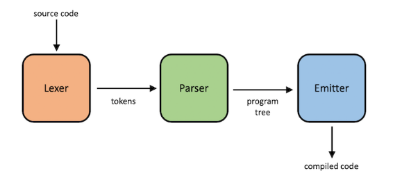

# Quê qué isso?
Um "compilador" escrito em python3, pra uma linguagem duvidosa. Abaixo tem mais detalhes sobre ela,
mas a ideia aqui foi centrar-se nos conceitos que envolvem o dedsenvolvimento de um compilador.

# Execucao:
Pode-se chamar o compilador diretamente
```
$ python3 complicador.py -i <arquivo_entrada.cmp> -o <arquivo_saida.c>
```
E entao, posteriormente compilar o código C (intermediário) gerado:

```
$ gcc -o programa codigo.c
$ ./programa
```

**Ou executar direto com o `complicar.sh`**:

```
$ bash complicar.sh <arquivo_entrada.cmp>
```

Após isso, é só executar o executavel:
```
$ ./arquivo_entrada
```

Exemplo:

*existem alguns exemplos na pasta 'exemplos'*
```
$ bash complicar.sh exemplos/fibonacci.cmp
$ ./fibonacci
```

ou

```
$ bash complicar.sh exemplos/average.cmp
$ ./average
```

---
# A linguagem
Nossa linguagem é super simples, e compreende apenas operações básicas de uma *programming language*:
- Variáveis numéricas (apenas float)
- Aritmética básica (+, -, /, *)
- Laço while
- Print de *strings* e números
- Input de números
- Labels e Goto
- Comentários

E possui as palavras-chave:
- PONTOTURISTICO = label
- VIAJAR = goto 
- MOSTRAAI = print
- LERDOTECLADO = scan
- ARBITRODEVIDEO = var
- TESTAPOPAI = if
- ENTAO = then
- VALEUOTESTE = endif
- ENQUANTO = while
- REPETE = repeat
- CANSEIDEREPETIR = endwhile

Comentários são com //
# Estrutura



O compilador (COMPLICADOR) segue tres passos que são descritos na figura acima. Primeiramente,
se tem uma entrada, que logo é quebrada em partes -- **TOKENS** (análise léxica).
*Tokens* são chars ou palavras definidas previamente. 
Logo, é feito um **PARSE** (análise sintática/semântica) dos tokens para entender se eles seguem
a ordem definida pela nossa linguagem (gramática). Por ultimo, é **EMITIDO** um
código C que corresponde à tradução da linguagem.

# 1. O lexer
Dado uma string, esse carinha deve iterar char por char e fazer duas coisas:
- Decidir onde cada *token* começa e termina
- E definir que tipo de *token* ele é

se o lexer não conseguir fazer isso, deve emitir um erro.

# 2. O Parser
O *parsers* é o carinha que vai garantir que o código segue a sintaxe correta.
Ele faz isso olhando percorrendo os tokens, e vai vendo se a ordem esta certa pelo
que foi definido pela **gramatica da linguagem**.

## 2.1 A gramatica da linguagem:

```
program ::= {statement}
statement ::= "MOSTRAAI" (expression | string) nl
    | "TESTAPOPAI" comparison "ENTAO" nl {statement} "VALEUOTESTE" nl
    | "ENQUANTO" comparison "REPETE" nl {statement} "CANSEIDEREPETIR" nl
    | "PONTOTURISTICO" name nl
    | "VIAJAR" name nl
    | "ARBITRODEVIDEO" name "=" expression nl
    | "LERDOTECLADO" name nl
comparison ::= expression (("==" | "!=" | ">" | ">=" | "<" | "<=") expression)+
expression ::= term {( "-" | "+" ) term}
term ::= unary {( "/" | "*" ) unary}
unary ::= ["+" | "-"] primary
primary ::= number | name
nl ::= '\n'+ 
```

### 2.1.1 Program

`program ::= {statement}`
Um programa (program) é feito por uma ou mais declarações (statement)

Já um *statement* é uma outra regra de gramática:
### 2.1.2 Statement:
`statement ::= "MOSTRAAI" (expression | string) nl`

A regra de estrutura aqui, é definida como uma palavra-chave PRINT, 
seguida por uma expressão ou uma `string`, finalizando com uma quebra de linha.

(Sendo string como um tipo de token definido pelo lexer)

Pode-se adicionar novas regras na declaração:

```
statement ::= "MOSTRAAI" (expression | string) nl
    | "TESTAPOPAI" comparison "ENTAO" nl {statement} "VALEUOTESTE" nl
    | "ENQUANTO" comparison "REPETE" nl {statement} "CANSEIDEREPETIR" nl
```

Agora, a regra do *statement* tem três opções: um PRINT, um LET ou um IF. Uma estrutura LET, 
significa a atribuição de um valor a uma variavel; A definição é a palavra-chave LET seguida por
um name e um "=" finalizando com uma *expression* e uma quebra de linha. `name` é um tipo de token
definido no lexer, que é o identificador da variávele; e expression é uma outra regra gramatical.
Uma declaração de IF é uma comparison seguida da palavra chave THEN, uma quebra de linha, 
um novo *statement* (**RECURSIVIDADE**), e uma outra palavra chave ENDIF, 
sinalizando o final do teste, e uma quebra de linha.

O restante das regras seguem o mesmo esquema. 

- {} significa zero ou mais
- [] significa zero ou um
- '+' significa um ou mais
- () é um agrupamento
- | ou lógico

### 2.1.3 expression
Expressões (*expression*) é alguma coisa que pode ser avaliada a um valor, como uma expressão
matemática (1 + 5 * 3) ou uma expressão booleana (x >= 10).

As expressões são essas:
```
comparison ::= expression (("==" | "!=" | ">" | ">=" | "<" | "<=") expression)+
expression ::= term {( "-" | "+" ) term}
term ::= unary {( "/" | "*" ) unary}
unary ::= ["+" | "-"] primary
primary ::= number | name
```


Para atingir diferentes níveis de precedência, as regras gramaticais 
foram organizadas sequencialmente. Operadores com maior precedência 
precisam estar em níveis “inferiores” na gramática, consequentemente
mais baixos na árvore de análise. Os operadores mais próximos 
dos tokens na árvore (perto das folhas) terão uma precedência maior.

Fazendo isso, garante-se a ordem de operadores que se espera, por exemplo, 
em expressões matemáticas: 1 + 2 × 3 deve retornar 7, e não 9. 
Nas regras definidas, os operadores unários + e - (ex.: +5, -10)
estão mais baixos na árvore, então eles possuem maior precedência do que os operadores
× e /, que possui maior precedência que operadores binários + e -.

### 2.1.4 Comparison
Na regra de comparação, não queremos que operadores (ex.: !=) sejam permitidos 
em expressões matemáticas. Por isso, para controlar onde eles de fato são permitidos
(loops e testes condicionais), tem-se uma regra especial para eles que requer
pelo menos um operador de comparação. No lado esquerdo e direito do operador
ded comparação está uma *expression*. Agora, em qualquer lugar que permitimos
apenas expressões matemáticas, esperamos por uma *expression*, e em qualquer lugar
em que se permite uma expressão booleana, esperamos por uma *comparison*.

# 3. O Emitter
O *Emitter* (ou mesmo, gerador ou emissor) será o carinha que “produzirá” o código. 
Nesse caso, vamos gerar um código em C. Isso significa que aqui não faremos trabalho sujo
de passar por código intermediário (pois o próprio C já será uma espécie disso), e
não iremos ver um assembly, ou qualquer outra coisa complexa.

Em cada função do *parser*, será chamado o emitter para produzir o código C apropriado.
O *emitter* nesse caso, irá concatenar um monte de strings, conforme desce na 
árvore analítica. Para cada regra gramatical, deve-se descobrir o que seria o equivalente
em C.

---
full baseado no [teenytiny](https://github.com/AZHenley/teenytinycompiler)
